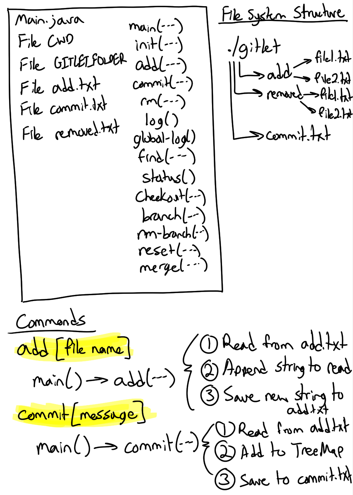
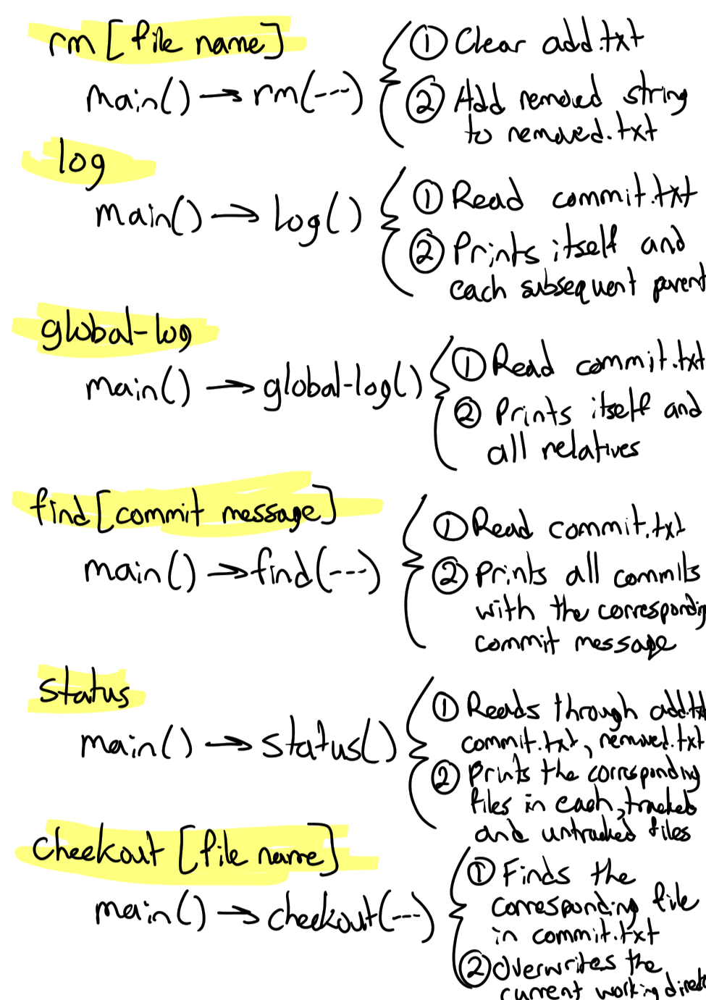
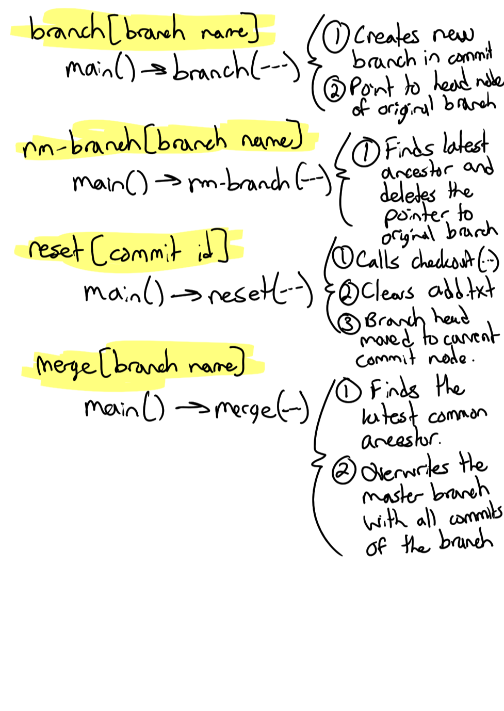

# Gitlet Design Document
**author:** Tyler Le

## 1. Classes and Data Structures
### Main.java
This class is the entry point of the program. It implements methods to set up persistance and support each command of the program.

#### Fields

1. static final File CWD: A pointer to the current working directory of the program.
2. static final File GITLET_FOLDER: A pointer to the `GITLET` directory in the current working directory.

### UnitTest.java
This class is the entire suite of all JUnit tests for the gitlet package.

## 2. Algorithms

### Main.java
1. Main(String[] args): This is the entry point of the program. It first cheecks to make sure that the input array is not empty. Then, it calls `init` to create a `/.gitlet` for persistance. Lastly, depending on the input argument, different functions are called to perform the operation. 
2. init(): If the directory for persisting git commits does not exist yet, then make the directory. The directy `.gitlet` will be created at the same time when the `add` and `commit` and `branch` directories are being made.
3. add(String[] args): It takes the first non-command argument in args and matches with a corresponding file in the program. If no such file is found, it will exit while printing `File does not exist`. Then it will add the corresponding file to a file called `add.txt` in the .gitlet/add directory. If the `add.txt` file exists, read the contents and concatenate the string with the new content. Accordingly, it will only concatenate the strings with each other if they are of the same file name, otherwise it will be pushed down to the next line of the file. Then, we write to `add.txt` for persistence.
4. commit(String[] args): It will track and save files staged in the `add.txt`, in which all the files staged will be tagged with the corresponding commit message passed in. A TreeMap of commits will be created in a `commit.txt` file in the `commit` directory such that each time a commit is made, the tree is extended, and the contents in `commit.txt` is concatenated with the new contents. Additionally, any files that were committed are now removed from `add.txt` ensuring a blank stage for the next adds. `add.txt` should be blank.
5. rm(String[] args): It will find the corresponding file in the `add.txt` and unstage it (removing it from the file). It then adds that file that was removed to `removed.txt`
6. log(): It first reads out the contents through `commit.txt` and then it advances through the parents of each commit in the TreeMap structure starting at the current head commit printing out information regarding each commit (commit message, commit id, and timestamp) until it reaches the root node.
7. global-log(): Similar to log() but prints out all commits in the TreeMap, but order of commits printed does not matter.
8. find(String[] args): It reads out the contents through `commit.txt` and then it advances through the parents, siblings, and children of each commit in the TreeMap structure and prints out the corresponding information if the input matches the commit message attached to the commit.
9. status(): It checks the existence and reads `add.txt` and `branch.txt` and `removed.txt`, printing out the corresponding files in each category. It also compares files in the current working directory to a previous commit that have changed/modified. Lastly, files not tracked will be labeled as such and listed.
10. checkout(String[] args): It takes the version of the file specified and overwrites the file in the working directory. It should go through the commit TreeMap to either identify the file name or commit id. When checking out a branch, we will take the specified branch name and put the entire branch at the head of our current branch, additionally the files in that branch will overwrite the current working directory.
11. branch(String[] args): This command creates a new branch that points to the current head node of the commit TreeMap. Additonally, only unique branches can be created as `A branch with that name already exists` will be outputed if there is a branch with that name already.
12. rm-branch(String[] args): Only deletes the branch pointer in the TreeMap, but does not delete all the commits made follwing the branch. 
13. reset(String[] args): It checks out all files being tracked by the current commit. `add.txt` should be empty as the staging area is cleared. Additionally, the current branch's head is moved to the current commit node in the TreeMap.
14. merge(String[] args): It goes through the current branch and finds the latest common ancestor in the tree, called the split point. All the modified files in the branch is then overwritten in the master branch.

## 3. Persistence

### add [file name]
- When a file name is appended to `add.txt`, we concatenate with other staged files in `add.txt`, and write the updated stage back to `add.txt`.

### commit [message]
- When a file name is appended to `commit.txt`, we read the contents of `commit` directory. Then, we add the current commit to the TreeMap of commits. After, we write it back to the `commit.txt` file. 

### rm [file name]
- We read through the `commit.txt` file and then search through the TreeMap for the same commit id as the input given. Then, we write back to `commit.txt`.

### rm-branch [branch name]
- Reads through the commit TreeMap and deletes the branch pointer to the master branch. Then, the updated TreeMap is written back onto `commit.txt`

### reset [commit id]
- After checking out all the files tracked by the current commit, `add.txt` is made empty to represent the staging area is cleared.

## 4. Design Diagram

